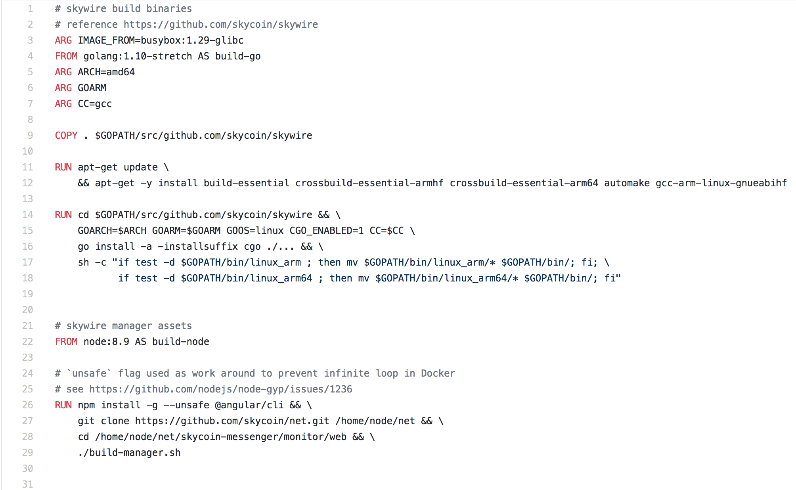
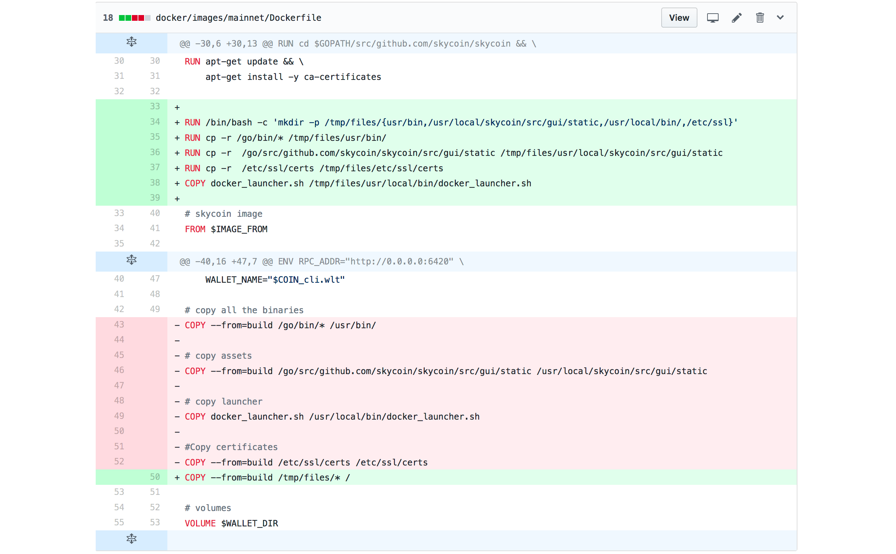

## Skycoin Infrastructure
#### Docker images. Best practices

----------------

#### These slides: [slides.skycoin.net/skycoin.docker.html](http://slides.cuban.tech/skycoin.docker.html)

#### Authors : Olemis Lang , and the Skycoin community
###### powered by [reveal.js](https://revealjs.com/)

----------------

###### The Skycoin Platform is the most advanced blockchain platform in the world.

---

## Outline

- Docker best practices
- Multi-stage builds in Skycoin Dockerfile's
- Build `arm` images on `amd64` architectures. Hooks.
- Designing entry points for seamless command execution.
- Map container user IDs to host user IDs
- Virtualizing developer workspaces
- Wishlist
  * Multi-base images
  * OS base images without package manager

--

## Outline
#### Virtual workspaces

- Development base image
- Docker development inside Docker containers
- Support multiple languages (PySkycoin, .NET). Client libraries.
- Run your favorite IDE inside Docker containers (VS Code example)
- Eclipse Che. What is it?
  * What are Docker containers used for?
- Codenvy

---

## Skycoin Docker images
#### Use build arguments

- Base image
  * Switch smoothly from one OS to the other
  * Upgrades in programming language tools needed by your app
- Software version, build info
- `RUN` command arguments
  * e.g. Golang `ARCH`
- Support multiple versions of tools , languages , ...
  * e.g. py2 vs py3

--

## Skycoin Docker images 
#### Use build arguments


---

## Skycoin Docker images
#### Build for multiple architectures

- Project goal: run on Raspberry Pi , Orange Pi and alike
- Publish as image tags. Use build hooks.

--

## Skycoin Docker images
#### skycoin/skycoin [build hook](https://github.com/skycoin/skycoin/tree/develop/docker/images/mainnet/hooks/build)

```sh
#!/bin/bash
cd ../../../
docker build -f $DOCKERFILE_PATH -t $IMAGE_NAME .
docker build --build-arg=ARCH=arm --build-arg=GOARM=5 --build-arg=IMAGE_FROM="arm32v5/busybox" -f $DOCKERFILE_PATH -t $IMAGE_NAME-arm32v5 .
docker build --build-arg=ARCH=arm --build-arg=GOARM=6 --build-arg=IMAGE_FROM="arm32v6/busybox" -f $DOCKERFILE_PATH -t $IMAGE_NAME-arm32v6 .
docker build --build-arg=ARCH=arm --build-arg=GOARM=7 --build-arg=IMAGE_FROM="arm32v7/busybox" -f $DOCKERFILE_PATH -t $IMAGE_NAME-arm32v7 .
docker build --build-arg=ARCH=arm64 --build-arg=IMAGE_FROM="arm64v8/busybox" -f $DOCKERFILE_PATH -t $IMAGE_NAME-arm64v8 .
```

--

## Skycoin Docker images
#### Using build args with golang

```Dockerfile

RUN cd $GOPATH/src/github.com/skycoin/skycoin && \
    COMMIT=$(git rev-parse HEAD) BRANCH=$(git rev-parse -—abbrev-ref HEAD) \
    GOARCH=$ARCH GOARM=$GOARM CGO_ENABLED=0 GOOS=linux \
    GOLDFLAGS="-X main.Commit=${COMMIT} -X main.Branch=${BRANCH}" \
    go install -ldflags "${GOLDFLAGS}" ./cmd/... && \
    sh -c "if test -d $GOPATH/bin/linux_arm ; then mv $GOPATH/bin/linux_arm/* $GOPATH/bin/; fi; \
           if test -d $GOPATH/bin/linux_arm64 ; then mv $GOPATH/bin/linux_arm64/* $GOPATH/bin/; fi"

```

--

## Skycoin Docker images
#### skycoin/skycoin [push hook](https://github.com/skycoin/skycoin/tree/develop/docker/images/mainnet/hooks/push)

```sh
#!/bin/bash
docker push $IMAGE_NAME
docker push $IMAGE_NAME-arm32v5
docker push $IMAGE_NAME-arm32v6
docker push $IMAGE_NAME-arm32v7
docker push $IMAGE_NAME-arm64v8
```

---

# What if there is no cross compilation?

#### Example using `cgo`

---

## Skycoin Docker images
#### Cross-Compiling

```sh
#!/bin/bash
docker build --build-arg=CC=arm-linux-gnueabihf-gcc --build-arg=ARCH=arm --build-arg=GOARM=7 --build-arg=IMAGE_FROM="arm32v7/busybox" -f $DOCKERFILE_PATH -t $DOCKER_REPO:arm32v7 .

docker build --build-arg=CC=aarch64-linux-gnu-gcc --build-arg=ARCH=arm64 --build-arg=IMAGE_FROM="arm64v8/busybox" -f $DOCKERFILE_PATH -t $DOCKER_REPO:arm64v8 .
```

--

## skycoin/skywire : CC arg



---

## Skycoin Docker images
#### Multi-stage builds

```Dockerfile
# skycoin build
# reference https://github.com/skycoin/skycoin
ARG IMAGE_FROM=busybox
FROM golang:1.11-stretch AS build
ARG ARCH=amd64
ARG GOARM
ARG SKYCOIN_VERSION

# ... build details ...

# skycoin image
FROM $IMAGE_FROM
```

---

## Skycoin Docker images
#### Multi-stage builds

Busybox? Why not Alpine ?

---

## `alpine` as base image

- No images for architectures `arm6` and `arm8`
- Includes `apk` package manager
  * Software package set in production images should be frozen
    - **Don't install unnecessary packages**
    - ... generally speaking there could be exceptions
    - **Job offer** : Images for main OS, no package manager
  * [Vulnerabilities found](https://justi.cz/security/2018/09/13/alpine-apk-rce.html) recently (2018)
- `busybox` image works and is even smaller

--

### `skycoin/skycoin` tags


---

## Skycoin Docker images
#### `skycoin/skywire` : Multiple transient images


---

## Skycoin Docker images
#### `skycoin/skycoin:release-v0.24.1` layers

[](https://microbadger.com/images/skycoin/skycoin:release-v0.24.1)

##### microbadger.com

---

## Skycoin Docker images - the plan
#### How to reduce number of layers?

- Transient containers as usual
- Copy files in source repository into transient build image
- New folder in transient image with fs layout needed in production
- Create tar archive
- Create temp volume in final image
- Copy the tar archive onto temp volume
- Extract .tar contents, then remove it

--

## Skycoin Docker images
#### Changes in Dockefile - build image

```Dockerfile

RUN /bin/bash -c 'mkdir -p /tmp/ficheros/{usr/bin,/usr/local/skycoin/src/gui/static,/usr/local/bin/,/etc/ssl}'
RUN cp -r /go/bin/* /tmp/ficheros/usr/bin/
RUN cp -r  /go/src/github.com/skycoin/skycoin/src/gui/static /tmp/ficheros/usr/local/skycoin/src/gui/static
RUN cp -r  /etc/ssl/certs /tmp/ficheros/etc/ssl/certs
COPY docker_launcher.sh /tmp/ficheros/usr/local/bin/docker_launcher.sh

RUN tar pcf /basefiles.tar -C /tmp/ficheros/ .
```

--

## Skycoin Docker images
#### Changes in Dockefile - final image

```
# copy all the binaries
VOLUME ["/tmp/files"]
COPY --from=build /basefiles.tar /tmp/files
WORKDIR /
RUN ["tar", "xf", "/tmp/files/basefiles.tar"]
```

--

## Skycoin Docker images
#### Build results in Docker Cloud

```
Step 22/26 : RUN tar xf /tmp/basefiles.tar.gz && rm /tmp/basefiles.tar.gz
---> Running in 000fd1768777
standard_init_linux.go:190: exec user process caused "exec format error"
The command '/bin/sh -c tar xf /tmp/basefiles.tar.gz && rm /tmp/basefiles.tar.gz' returned a non-zero code: 1
build hook failed! (1)
ERROR: Build failed: build hook failed! (1)
ERROR: Build failed with exit code 2
ERROR: Build in 'stdevNorge_t1903_docker_reduce_image:/docker/images/mainnet/Dockerfile' (bf192831) failed in 0:14:03
```

---

## Skycoin Docker images
#### Squash layers in build hook

```sh
#!/bin/bash
cd ../../../
docker build --squash -f $DOCKERFILE_PATH -t $IMAGE_NAME .
docker build --squash --build-arg=ARCH=arm --build-arg=GOARM=5 --build-arg=IMAGE_FROM="arm32v5/busybox" -f $DOCKERFILE_PATH -t $IMAGE_NAME-arm32v5 .
docker build --squash --build-arg=ARCH=arm --build-arg=GOARM=6 --build-arg=IMAGE_FROM="arm32v6/busybox" -f $DOCKERFILE_PATH -t $IMAGE_NAME-arm32v6 .
docker build --squash --build-arg=ARCH=arm --build-arg=GOARM=7 --build-arg=IMAGE_FROM="arm32v7/busybox" -f $DOCKERFILE_PATH -t $IMAGE_NAME-arm32v7 .
docker build --squash --build-arg=ARCH=arm64 --build-arg=IMAGE_FROM="arm64v8/busybox" -f $DOCKERFILE_PATH -t $IMAGE_NAME-arm64v8 .
```

--

## Skycoin Docker images
#### Squash not supported (yet?) in Docker Cloud

```
Building in Docker Cloud's infrastructure...
Cloning into '.'...
Switched to a new branch 'stdevNorge_t1903_docker_reduce_image'
Pulling cache layers for index.docker.io/simelotech/skycoin:feature-olemis-1835...
Done!
Executing build hook...
"--squash" is only supported on a Docker daemon with experimental features enabled
"--squash" is only supported on a Docker daemon with experimental features enabled
"--squash" is only supported on a Docker daemon with experimental features enabled
"--squash" is only supported on a Docker daemon with experimental features enabled
"--squash" is only supported on a Docker daemon with experimental features enabled
build hook failed! (1)
ERROR: Build failed: build hook failed! (1)
ERROR: Build failed with exit code 2
ERROR: Build in 'stdevNorge_t1903_docker_reduce_image:/docker/images/mainnet/Dockerfile' (bb64822a) failed in 0:01:45
```

---

## Let's try once again



--

## Skycoin Docker images
#### Single layer for `skycoin/skycoin` image

```
$ docker history --no-trunc simelotech/skycoin:feature-stdevNorge-1903
IMAGE                CREATED             CREATED BY                                                                                                                          SIZE                COMMENT
sha256:d77e7bf9b83   About an hour ago   /bin/sh -c #(nop)  ENTRYPOINT ["docker_launcher.sh" "--web-interface-addr=0.0.0.0" "--gui-dir=/usr/local/skycoin/src/gui/static"]   0B
<missing>            About an hour ago   /bin/sh -c #(nop)  EXPOSE 6000 6420                                                                                                 0B
<missing>            About an hour ago   /bin/sh -c #(nop)  VOLUME [/data/.skycoin]                                                                                          0B
<missing>            About an hour ago   /bin/sh -c #(nop)  VOLUME [/wallet]                                                                                                 0B
<missing>            About an hour ago   /bin/sh -c #(nop) COPY multi:a391c93b86aa205585f38d15670e32ced770a2b67783bc632460b2b9cb96ddad in /                                  68.2MB
<missing>            About an hour ago   /bin/sh -c #(nop)  ENV RPC_ADDR=http://0.0.0.0:6420 DATA_DIR=/data/.skycoin WALLET_DIR=/wallet WALLET_NAME=.wlt                     0B
<missing>            About an hour ago   /bin/sh -c #(nop)  ENV COIN=skycoin                                                                                                 0B
<missing>            7 weeks ago         /bin/sh -c #(nop)  CMD ["sh"]                                                                                                       0B
<missing>            7 weeks ago         /bin/sh -c #(nop) ADD file:96fda64a6b725d4df5249c12e32245e2f02469ff637c38077740f4984cd883dd in /                                    1.16MB
```

---

## Skycoin Docker images
#### Image entrypoint scripts

- Image acts as executeable

```sh
docker run -d skycoin/skycoin -enable-api-sets READ,WALLET,INSECURE_WALLET_SEED`
```

- Run services as non-root user
- Graceful execution of other commands

---

## Image entrypoint script
#### `skycoin/skycoin` command line args and users

```sh
#!/bin/sh
COMMAND="skycoin --data-dir $DATA_DIR --wallet-dir $WALLET_DIR $@"

adduser -D -u 10000 skycoin

if [[ \! -d $DATA_DIR ]]; then
    mkdir -p $DATA_DIR
fi
if [[ \! -d $WALLET_DIR ]]; then
    mkdir -p $WALLET_DIR
fi

chown -R skycoin:skycoin $( realpath $DATA_DIR )
chown -R skycoin:skycoin $( realpath $WALLET_DIR )

su skycoin -c "$COMMAND"
```

---

## Image entrypoint script
#### `library/docker` graceful command execution

```sh
#!/bin/sh
set -e

# no arguments passed
# or first arg is `-f` or `--some-option`
if [ "$#" -eq 0 ] || [ "${1#-}" != "$1" ]; then
  # add our default arguments
  set -- dockerd \
    --host=unix:///var/run/docker.sock \
    --host=tcp://0.0.0.0:2375 \
    "$@"
fi

if [ "$1" = 'dockerd' ]; then
  # if we're running Docker, let's pipe through dind
  # (and we'll run dind explicitly with "sh" since its shebang is /bin/bash)
  set -- sh "$(which dind)" "$@"

  # explicitly remove Docker's default PID file to ensure that it can start properly if it was stopped uncleanly (and thus didn't clean up the PID file)
  find /run /var/run -iname 'docker*.pid' -delete
fi

exec "$@"
```

---

## Skycoin Docker images
#### Virtual workspaces

- `skycoindev-cli:develop` dev base image
- `skycoindev-cli:dind` workspace + `dockerd`
- `skycoindev-python:develop` for PySkycoin
- `skycoindev-dotnet:develop`
  * .NET client library coming soon

---

## Skycoin Docker images
#### Final remarks

- Ephemeral containers : `/data` and `/wallet` volumes
- Decouple applications
  * Interactions with external services via REST API
  * **Job offer : ** Prometheus API exporter
- Open questions
  * Efficient mount of huge files e.g. BTC blockchain
  * Multi-base image e.g. `skycoindev-cli:dind`

---

## Thanks for your time!

## Questions?

