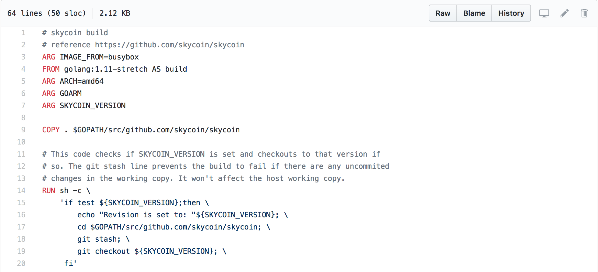
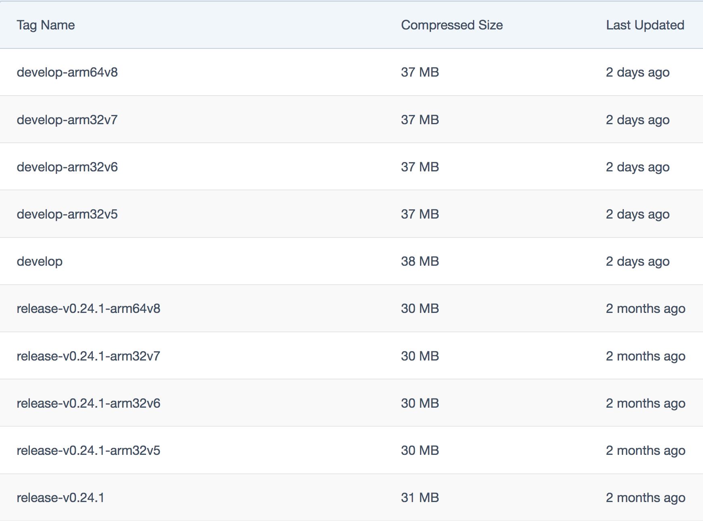
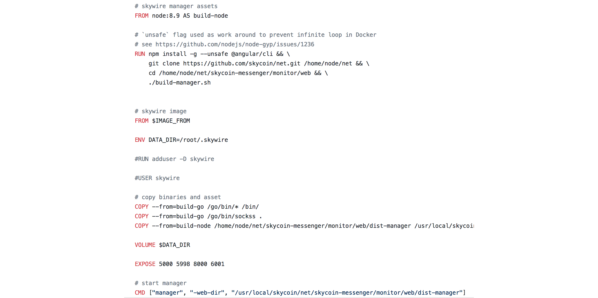

## Skycoin Infrastructure
#### Docker images. Best practices

----------------

#### These slides: [slides.skycoin.net/skycoin.docker.html](http://slides.cuban.tech/skycoin.docker.html)

#### Authors : Olemis Lang , Ariel Lima , and the Skycoin community
###### powered by [reveal.js](https://revealjs.com/)

----------------

###### The Skycoin Platform is the most advanced blockchain platform in the world.

--

## Outline

- Docker best practices
- Multi-stage builds in Skycoin Dockerfile's
- Build `arm` images on `amd64` architectures. Hooks.
- Designing entry points for seamless command execution.
- Map container user IDs to host user IDs
- Virtualizing developer workspaces
- Wishlist
  * Multi-base images
  * OS base images without package manager

---

## Outline
#### Virtual workspaces

- Development base image
- Docker development inside Docker containers
- Support multiple languages (PySkycoin, .NET). Client libraries.
- Run your favorite IDE inside Docker containers (VS Code example)
- Eclipse Che
  * What is it?
  * What are Docker containers used for?
- Codenvy

--

## Skycoin Docker images
#### Use build arguments

Mainly for:

- Base image
  * Switch smoothly from one OS to the other
  * Upgrades in programming language tools needed by your app
- Software version, build info
- Dockerfile command arguments
  * Golang `ARCH`

---

## Skycoin Docker images 
#### Use build arguments



--

## Skycoin Docker images
#### Build for multiple architectures

- Project goal: run on Raspberry Pi , Orange Pi and alike
- Publish as image tags. Use build hooks.

---

## Skycoin Docker images
#### skycoin/skycoin [build hook](https://github.com/skycoin/skycoin/tree/develop/docker/images/mainnet/hooks/build)

```sh
#!/bin/bash
cd ../../../
docker build -f $DOCKERFILE_PATH -t $IMAGE_NAME .
docker build --build-arg=ARCH=arm --build-arg=GOARM=5 --build-arg=IMAGE_FROM="arm32v5/busybox" -f $DOCKERFILE_PATH -t $IMAGE_NAME-arm32v5 .
docker build --build-arg=ARCH=arm --build-arg=GOARM=6 --build-arg=IMAGE_FROM="arm32v6/busybox" -f $DOCKERFILE_PATH -t $IMAGE_NAME-arm32v6 .
docker build --build-arg=ARCH=arm --build-arg=GOARM=7 --build-arg=IMAGE_FROM="arm32v7/busybox" -f $DOCKERFILE_PATH -t $IMAGE_NAME-arm32v7 .
docker build --build-arg=ARCH=arm64 --build-arg=IMAGE_FROM="arm64v8/busybox" -f $DOCKERFILE_PATH -t $IMAGE_NAME-arm64v8 .
```

---

## Skycoin Docker images
#### Using build args with golang


---

## Skycoin Docker images
#### skycoin/skycoin [push hook](https://github.com/skycoin/skycoin/tree/develop/docker/images/mainnet/hooks/push)

```sh
#!/bin/bash
docker push $IMAGE_NAME
docker push $IMAGE_NAME-arm32v5
docker push $IMAGE_NAME-arm32v6
docker push $IMAGE_NAME-arm32v7
docker push $IMAGE_NAME-arm64v8
```

---

## Skycoin Docker images
#### CrossCompiling

```sh
#!/bin/bash
docker build --build-arg=CC=arm-linux-gnueabihf-gcc --build-arg=ARCH=arm --build-arg=GOARM=7 --build-arg=IMAGE_FROM="arm32v7/busybox" -f $DOCKERFILE_PATH -t $DOCKER_REPO:arm32v7 .

docker build --build-arg=CC=aarch64-linux-gnu-gcc --build-arg=ARCH=arm64 --build-arg=IMAGE_FROM="arm64v8/busybox" -f $DOCKERFILE_PATH -t $DOCKER_REPO:arm64v8 .
```

--

# What if there is no cross compilation?

#### Example using `cgo`

--

## Skycoin Docker images
#### Compiling for Arm

```Dockerfile
FROM golang:1.10-stretch AS build-go
ARG ARCH=amd64
ARG GOARM
ARG CC=gcc

RUN apt-get update && apt-get -y install build-essential 
    crossbuild-essential-armhf \
    crossbuild-essential-arm64  \
    automake \
    gcc-arm-linux-gnueabihf

RUN GOARCH=$ARCH GOARM=$GOARM GOOS=linux CGO_ENABLED=1 CC=$CC \
    go install -a -installsuffix cgo ./...
...
```

---

## Skycoin Docker images
#### Multi-stage builds


--

## Skycoin Docker images
#### Multi-stage builds

Busybox? Why not Alpine ?

--

## Skycoin Docker images
#### Multi-stage builds

- No images for architectures `arm6` and `arm8`
- Includes `apk` package manager
  * Software package set in production images should be frozen
    - Best practice : **Don’t install unnecessary packages**
    - ... generally speaking there could be exceptions
    - **Job offer** : Images for main OS, no package manager
  * [Vulnerabilities found](https://justi.cz/security/2018/09/13/alpine-apk-rce.html) recently (2018)
- `busybox` image works and is even smaller

---

## Skycoin Docker images
#### `skycoin/skycoin` tags



--

## Skycoin Docker images
#### `skycoin/skywire` : Multiple transient images



--

## Skycoin Docker images - Suboptimal
#### `skycoin/skycoin:release-v0.24.1` layers

[](https://microbadger.com/images/skycoin/skycoin:release-v0.24.1)

##### microbadger.com

--

## Skycoin Docker images - Solution
#### How to reduce number of layers?

- Transient containers as usual
- Copy files in source repository into transient build image
- Transient image folder with fs layout needed in production
- Create tar archive
- Create temp volume in final image
- Copy the tar archive onto temp volume
- Extract .tar contents, then remove it

--

## Skycoin Docker images - Results
#### `skycoin/skycoin:feature-stdevNorge-1903` layers

[](https://microbadger.com/images/skycoin/skycoin:feature-stdevNorge-1903)

##### microbadger.com

--

## Skycoin Docker images
#### Other best practices

- Ephemeral containers : `/data` and `/wallet` volumes
- Decouple applications
  * Interactions with external services via REST API

